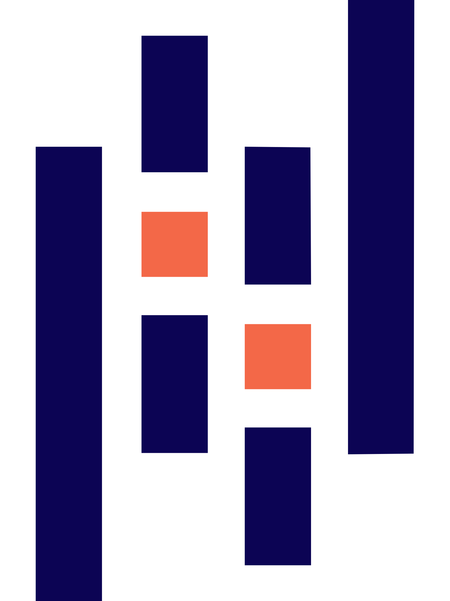
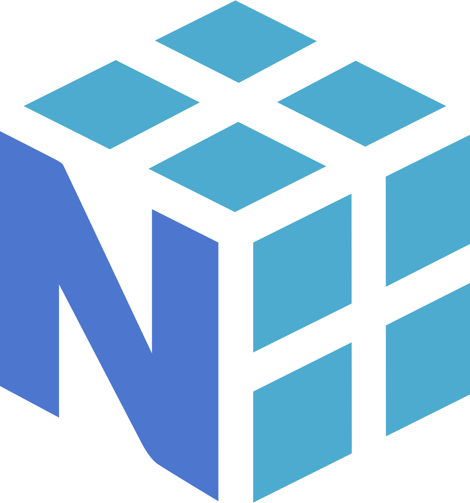
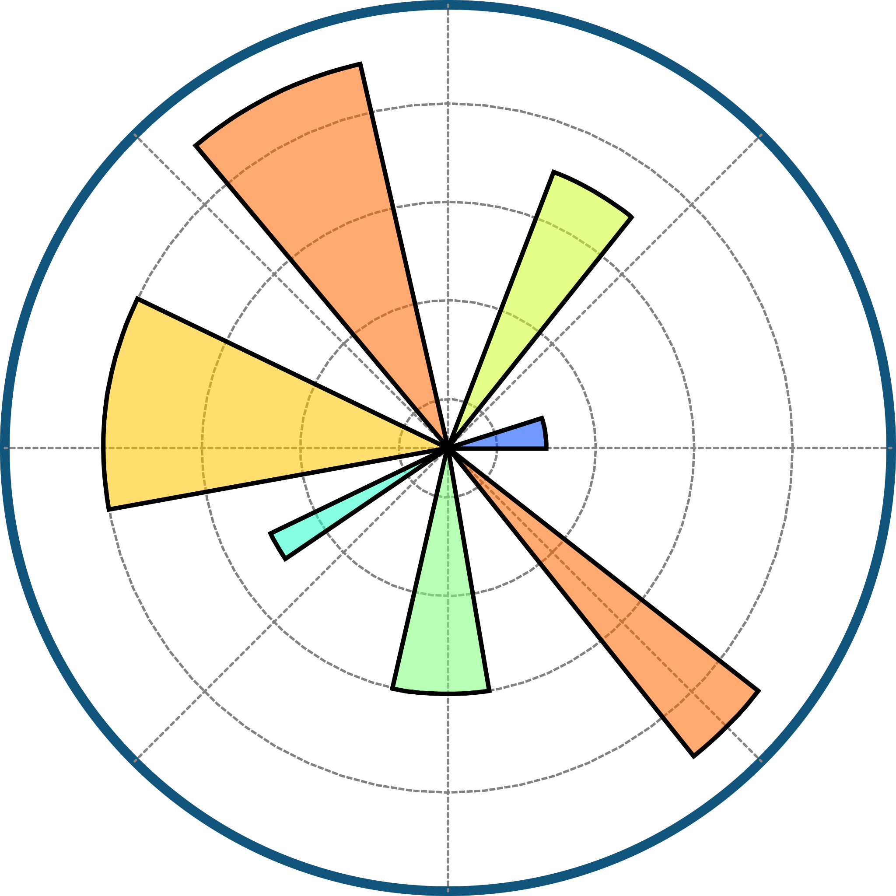

# 👨‍💻 Phan Trọng Nguyên

### Data Science 

# 💫 About Me
Hi, I'm a third-year Data Science student at the University of Industry and Trade. I am passionate about Data Analysis, Machine Learning and Big Data.  I enjoy working on projects related to:  * 📊 Data Analysis & Visualization * 🤖 Machine Learning & Deep Learning * 🗄️ Big Data & Data Engineering * 📈 Business Intelligence & Predictive Analytics * 🐍 Python, SQL, Power BI, and Docker  I am constantly learning new technologies and building real-world projects to improve my skills in data-driven problem solving. My goal is to become a Data Scientist who can transform data into meaningful insights and impactful solutions.  🚀 Always curious, always learning.

## 🌐 Socials
   

# 💻 Tech Stack

<table>

<tr>
<td align="center" width="90">
  
   Python
</td>

<td align="center" width="90">
  
   R
</td>

<td align="center" width="90">
  
   SQL
</td>

<td align="center" width="90">
  
   Excel
</td>

<td align="center" width="90">
  
   MySQL
</td>

<td align="center" width="90">
  
   SQLite
</td>

<td align="center" width="90">
  
   Docker
</td>

<td align="center" width="90">
  
   Git
</td>

<td align="center" width="90">
  
   GitHub
</td>

<td align="center" width="90">
  
   Anaconda
</td>

<tr>
<td align="center" width="90">
  
   PyTorch
</td>

<td align="center" width="90">
  
   TensorFlow
</td>

<td align="center" width="90">
  
   Hugging Face
</td>

<td align="center" width="90">
  
   Scikit
</td>

<td align="center" width="90">
  
   Flask
</td>

<td align="center" width="90">
  
   FastAPI
</td>

<td align="center" width="90">
  
   OpenCV
</td>

<td align="center" width="90">
  
   PostgreSQL
</td>

<td align="center" width="90">
  
   MongoDB
</td>

<td align="center" width="90">
  
   Azure
</td>
</tr>

<tr>
<td align="center" width="90">
  
   Pandas
</td>

<td align="center" width="90">
  
   NumPy
</td>

<td align="center" width="90">
  
   Matplotlib
</td>

<td align="center" width="90">
  
   Power BI
</td>

<td align="center" width="90">
  
   Tableau
</td>

<td align="center" width="90">
  
   VS Code
</td>

<td align="center" width="90">
  
   Markdown
</td>

<td align="center" width="90">
  
   MLflow
</td>

<td align="center" width="90">
  
   Plotly
</td>

<td align="center" width="90">
  
   Jupyter
</td>

</tr>

</table>

# 📊 GitHub Stats
 

## ✍️ Random Dev Quote

## 🐍 Contribution Snake

  

